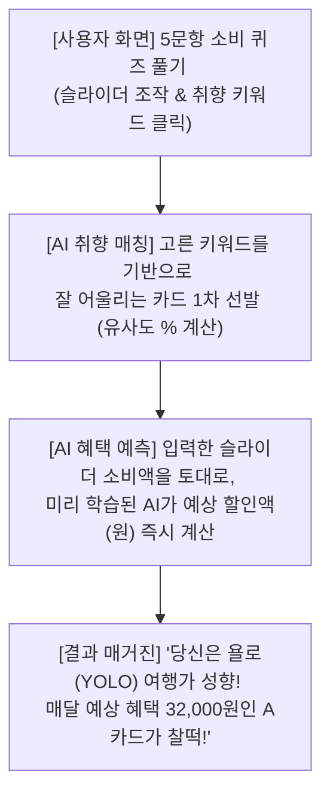

# 🔮 AI와 게임으로 찾는 내 인생 카드 추천 기획안

이 기획안은 처음 가입하여 데이터가 없는 사용자에게도 아주 쉽고 재밌는 **"5문항 퀴즈 게임"**을 통해 머신러닝 AI가 인생 카드를 즉시 찾아주는 서비스의 설계도입니다.

---

## 🧐 1. 우리의 진짜 문제 (시작점)

* **어려운 현실**: 보통 카드 추천 서비스들은 가입하자마자 복잡한 신용카드 명세서를 연동하라고 하거나, 매달 영역별로 얼마를 쓰는지 일일이 돈을 적어 넣으라고 합니다. 귀찮고 번거로워서 그냥 서비스를 이탈하는 사용자가 태반입니다.
* **해결책**: 가입 즉시 사용자를 귀찮게 하지 않고, 재미있는 보물찾기 퀴즈 게임을 즐기게 합니다. 사용자가 게임을 하는 동안, 인공지능이 뒤에서 알아서 돈을 가장 많이 아껴줄 카드를 영리하게 연산합니다.

---

## 🛠️ 2. AI 추천을 만드는 마법의 3가지 기술

우리는 아래의 세 가지 핵심 기술을 유기적으로 결합하여 완벽한 온보딩과 추천 경험을 만듭니다.

### 🤖 ① 마법의 가상 로봇 10만 명 (가상 데이터 생성 & AI 학습)
* **비유**: 실제 시험을 치르기 전에, 10만 명의 가상 학생 로봇을 만들어 미리 모의고사를 수만 번 풀게 하고 학습하는 것입니다.
* **설명**:
  * "기름을 매달 10만 원 넣는 로봇", "대형마트에서 50만 원 쓰는 로봇" 등 각양각색의 지출 패턴을 가진 가상 로봇 10만 명의 데이터를 난수로 생성합니다.
  * 카드사 공식 혜택 계산기(규칙 엔진)에 이 로봇들을 대입하여, 어떤 로봇이 어떤 카드에서 얼마나 할인받는지에 대한 **'모의고사 정답지'**를 미리 구합니다.
  * 이 대용량 정답지(지출 패턴 ➡️ 실제 할인 금액)를 머신러닝 AI(LightGBM/Decision Tree)에 학습시켜 지출 항목에 따른 할인 패턴을 달달 외우게 만듭니다.
* **효과**: 실제 사용자가 퀴즈를 통해 지출 패턴을 입력하면, AI는 복잡한 카드사 한도/실적 규칙을 일일이 실시간 연산할 필요 없이 **0.01초 만에** *"너는 이 카드를 쓰면 한 달에 25,000원 아낄 수 있어!"*라고 즉시 예상 혜택금을 예측해 줍니다.

### 📡 ② 취향 주파수 매칭 (텍스트 임베딩 매칭)
* **비유**: 나에게 잘 맞는 소울메이트를 찾기 위해 취향 주파수를 맞추는 돋보기입니다.
* **설명**:
  * 사용자가 "해외여행", "캠핑", "넷플릭스" 같은 라이프스타일 취향 단어를 고릅니다.
  * AI 텍스트 변환기(Embedding/유사도 모델)가 사용자의 관심 단어와 카드 혜택 설명 텍스트들의 **속뜻을 분석하여 수학적 거리(코사인 유사도)**를 계산합니다.
* **효과**: 사용자가 직접 소비 금액을 입력하지 않은 영역이 있더라도, 사용자가 좋아하는 관심사와 카드의 실제 혜택이 얼마나 일치하는지 **취향 매칭도(%)**를 정확하게 정렬해 제안합니다.

### 🎯 ③ 카드 보물찾기 5문항 퀴즈 (게임형 온보딩)
* **비유**: 딱딱한 가계부 기입 대신 재미있는 퀴즈 월드컵을 하는 것입니다.
* **설명**:
  * 사용자가 가입하면 5개의 쉽고 귀여운 퀴즈가 단계별로 등장합니다.
    * *예: "마트 장보기는 얼마나 하시나요?" (0원 ~ 100만 원 슬라이더 조절)*
    * *예: "주말엔 주로 대중교통을 타시나요, 아니면 운전하시나요?" (대중교통 vs 운전 클릭형)*
* **효과**: 사용자는 게임하듯 가볍게 마우스를 몇 번 조작했을 뿐이지만, AI 관점에서는 최적의 혜택을 계산해내기 위한 **핵심 지출 피처(Feature) 데이터**를 완벽하게 수집하게 됩니다.

---

## 🔄 3. 서비스 작동 시나리오 (시너지 창출)

1. **소비 퀴즈 풀기**: 사용자가 웹 화면에서 동적인 슬라이더와 키워드 칩을 클릭해 빠르게 답변을 완성합니다.
2. **AI 취향 매칭**: 선택된 키워드 주파수 데이터를 기반으로 유사도가 높은 카드 후보군을 1차 필터링합니다.
3. **AI 혜택 예측**: 입력받은 소비 규모를 피처로 삼아 학습된 ML 모델이 각 카드별 예상 월 할인액을 즉시 예측합니다.
4. **결과 매거진**: 사용자의 소비 MBTI 진단명(예: YOLO 여행가)과 함께 예상 혜택액 및 추천 TOP 3 카드를 한눈에 보여줍니다.

---

## 📈 4. 기대 효과

* **이탈률 0%**: 가입 즉시 명세서나 공인인증서 연동을 강요하지 않고 재미있게 접근하므로, 사용자가 도망가지 않고 끝까지 퀴즈에 참여합니다.
* **높은 신뢰도**: 단순한 감성/취향 중심의 추천을 넘어 **"당신이 입력한 패턴이라면 매월 정확히 32,800원을 아낄 수 있습니다"**라는 실제 화폐 가치의 정량적 수치를 제시하여 강력한 신뢰를 형성합니다.
* **가볍고 빠른 시스템**: 복잡한 카드사 연산 로직을 실시간으로 서버나 클라이언트에서 매번 무겁게 돌리지 않습니다. 10만 번 예습한 머신러닝 AI 모델 가중치가 브라우저 내부에서 즉각적으로 연산하므로, 속도가 매우 빠르고 서버 자원이 거의 소모되지 않습니다.
